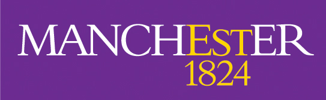








   
I am a dedicated Ph.D. candidate in Environmental Science at The University of Manchester , with a strong interest in data science and urban studies. My expertise lies in urban climate modeling, sustainable urban environments, and informed urban planning. My Ph.D. work centers on using data-driven approaches to address urban climate challenges, including capturing the dynamic interactions between urban and the atmosphere, and advancing models of urban surface features.

# 🔥 News
- *2025.10*: &nbsp;🎉🎉 Awarded the NeurIPS 2025 Scholar Award!
- *2025.10*: &nbsp;🎉🎉 🔥🔥 My PhD first project has been accepted to NeurIPS 2025! To the best of our knowledge, it will be the first urban climate study to appear at a top-tier AI venue.
- *2025.05*: Oral presentation accepted for the 12th International Conference on Urban Climate (Session S1: Digital Twins, AI/ML, and Open Data Science for Urban Climate); presentation forthcoming.
- *2025.03*: &nbsp;🎉🎉 Awarded the Doctoral Training and Development Support Fund by The University of Manchester!
- *2025.01*  Appointed as a Graduate Teaching Assistant for The Natural Scientists Toolkit course (2024–2025) at The University of Manchester.
- *2024.11*: &nbsp;🎉🎉 My academic homepage is online!

# 🗂 Projects 

Generative Adaptation of Urban Climate

[Urban Climate Adaptor]()

**Jiyang Xia**

[**Key Points**]
-

Automated LCZ Mapping Framework

[AutoML-optimized LCZ Mapping Framework & Urban Climate Modeling]()

**Jiyang Xia**, Yuan Sun, Fenghua Ling, Xinyue Ye, David Topping, Zhonghua Zheng

[**Key Points**]
- 

Urban Climate Emulator

[Learning Urban Climate Dynamics via Physics-Guided Urban Surface–Atmosphere Interactions]

**Jiyang Xia**, Fenghua Ling, Zhenhui Jessie Li, Junjie Yu, Hongliang Zhang, David Topping, Lei Bai, Zhonghua Zheng

[**Key Points**]
- Urban Climate
- Physics-guided ML
- Represent Learning
- Multi-task

# 📝 Publications 

- [Jiyang Xia, Yue Zhang*. Where Are Potential Areas for Transit-Oriented Development (TOD)—Exploring the Demands for Built Environment for TOD Planning. Sustainability. 2022, 14, 8364.](https://doi.org/10.3390/su14148364)
- Jiyang Xia, Yue Zhang*. Research on Spatial Spillover Effect of Highly Educated Migrants in Yangtze River Delta Urban Agglomerations Based on Urban Innovation. Areal Research and Development. 2022, 1, 162-168.

# 🎖 Honors and Awards
- *2025.10* NeurIPS 2025 Scholar Award
- *2025.05* Doctoral Training and Development Support Fund by The University of Manchester
- *2023.03* Excellent Postgraduate Students’ Award of Zhejiang Province (Top 1%)
- *2022.11* Sophia Yang Scholarship of ZJU, 2021-2022 Academic Year (Top 1%)
- *2022.10* Outstanding Postgraduate Award and “Triple-A” Student (academic records, morality, health) Award of ZJU
- *2020.09* Postgraduate Academic Scholarship of ZJU.
- *2018.09* National “Outstanding Work” Award at National Urban Transportation Innovation Practice Competition.

# 📖 Educations
- *2024.01 - now*, The University of Manchester, UK.  PhD. Candidate in Environmental Science
- *2020.09 - 2023.06*, Zhejiang University, China.  M.Sc. in Urban Planning (**GPA: 3.88/4.0, Ranking: 1/31**)
- *2015.09 - 2020.06*, Southwest Jiaotong University, China.  B.Eng. in Urban and Rural Planning

# 💬 Invited Talks
- *2025.07* [the 12th International Conference on Urban Climate](https://www.icuc12.eu/home.html) (Session S1: Digital Twins, AI/ML, and Open Data Science for Urban Climate), Rotterdam, Netherlands
- *2024.08*, [NERC's Digital Gathering 2024](https://www.digital-solutions.uk/dg24/schedule.html), Manchester, UK
- *2022.07*, 16th International Association for China Planning (IACP) Annual Conference, Session 7.3: Transit-oriented Development (TOD), Wuhan, China, June 23-27, 2022

# 💻 Internships
- *2024.03 - now*, AI for Earth in Shanghai AI lab, Shanghai, China.
- *2020.06 - 2020.08*, Assistant city planner, China Southwest Architectural Design and Research Institute Co., Ltd
